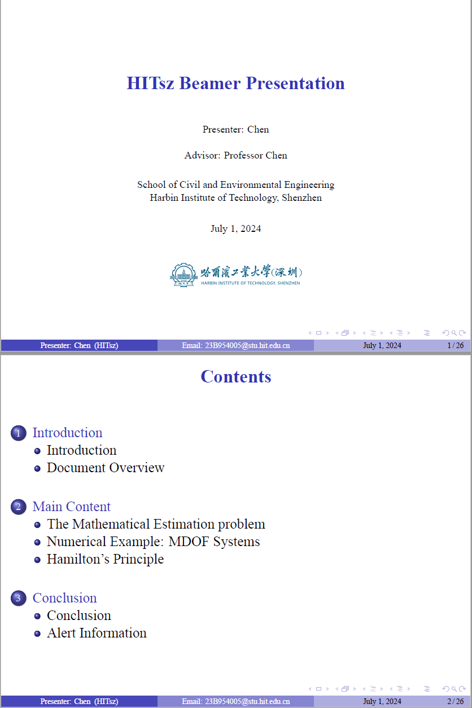
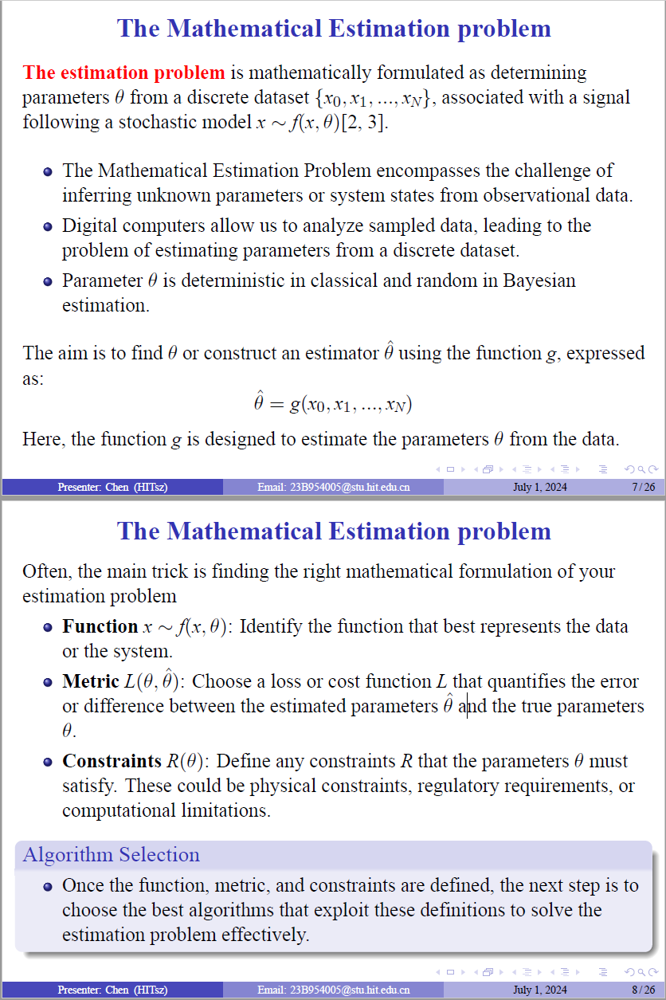
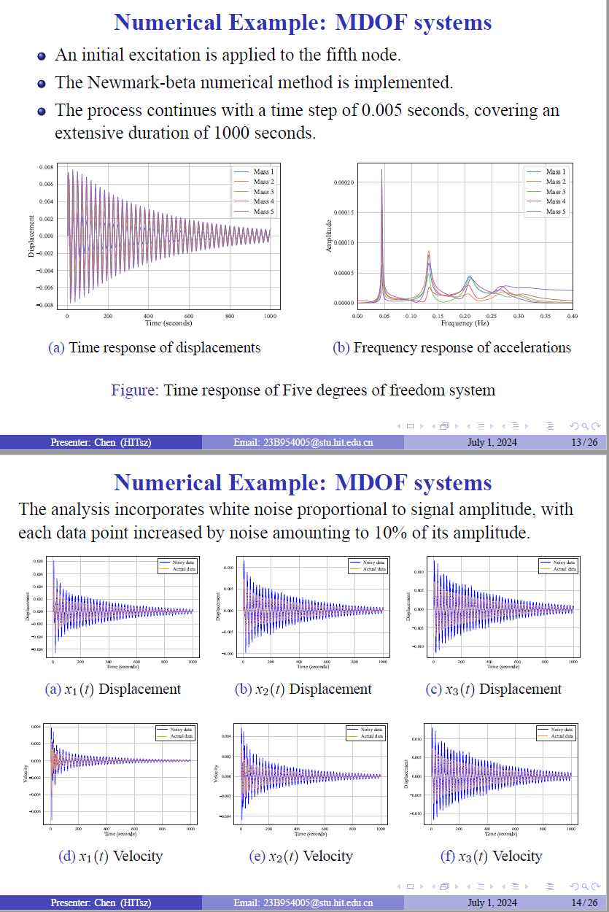
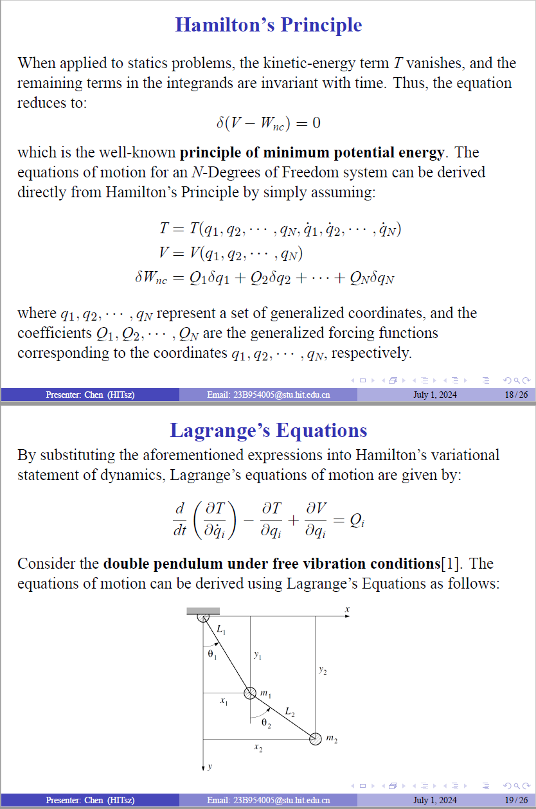
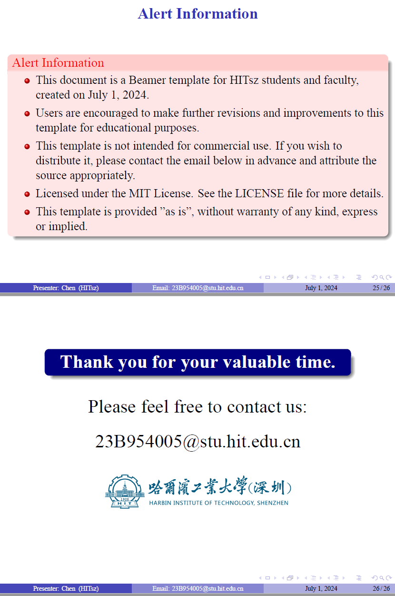

# 哈尔滨工业大学（深圳）Beamer模板

本仓库包含一个为HITsz学生和教职工设计的Beamer模板。此模板的主要目的是说明如何使用Beamer语法组织内容，并演示一些基本语法以供将来参考。

## 功能

- 使用Beamer语法组织内容的结构
- 学术演示的LaTeX实现示例
- 开源并可用于教育目的

## 使用方法

要使用此模板，只需克隆本仓库，并使用您喜欢的LaTeX编辑器编译`PPT.tex`文件。模板包括几个示例幻灯片，如介绍、文档概述、数学估计问题、卡尔曼滤波器、数值示例和哈密顿原理。

## 许可证

此模板遵循MIT许可证。详情请参阅[LICENSE](LICENSE)文件。

## 注意事项

- 本文档是为HITsz学生和教职工制作的Beamer模板，创建于2024年7月1日。
- 鼓励用户对该模板进行进一步的修订和改进，用于教育目的。
- 该模板不用于商业用途。如果您希望分享，请提前联系下面的邮箱，并适当注明来源。
- 本模板按“原样”提供，不提供任何明示或暗示的担保。

## 联系方式

如有任何疑问或请求，请联系：23B954005@stu.hit.edu.cn

## 文件

仓库包含以下文件：

- `PPT.tex`: 演示文稿的主要LaTeX源文件。
- `PPT.aux`, `PPT.bbl`, `PPT.blg`, `PPT.log`, `PPT.nav`, `PPT.out`, `PPT.snm`, `PPT.synctex.gz`, `PPT.toc`: 编译过程中生成的辅助文件。
- `hitsz.pdf`, `Five_degree_of_freedom_system.pdf`, `displacements_visualization.pdf`, `frequency_visualization.pdf`, `noised_displacement_vs_actual_mass_1.pdf`, `noised_displacement_vs_actual_mass_2.pdf`, `noised_displacement_vs_actual_mass_3.pdf`, `noised_Velocity_vs_actual_mass_1.pdf`, `noised_Velocity_vs_actual_mass_2.pdf`, `noised_Velocity_vs_actual_mass_3.pdf`: 演示文稿中使用的PDF文件。
- `double_.png`: 演示文稿中使用的一张图片。
- `references.bib`: 参考文献文件。

# HITsz Beamer Template

This repository contains a Beamer template designed for HITsz students and faculty. The main purpose of this template is to illustrate how to use Beamer syntax to organize content and to demonstrate some basic syntax for future reference.

## Features

- Organized content structure using Beamer syntax
- Example of a LaTeX implementation for academic presentations
- Open-source and available for educational purposes

## Usage

To use this template, simply clone the repository and compile the `PPT.tex` file using your preferred LaTeX editor. The template includes several sample frames, such as an introduction, document overview, mathematical estimation problem, Kalman filter, numerical example, and Hamilton's principle.

## License

This template is licensed under the MIT License. See the [LICENSE](LICENSE) file for more details.

## Notes

- This document is a Beamer template for HITsz students and faculty, created on July 1, 2024.
- Users are encouraged to make further revisions and improvements to this template for educational purposes.
- This template is not intended for commercial use. If you wish to distribute it, please contact the email below in advance and attribute the source appropriately.
- This template is provided "as is", without warranty of any kind, express or implied.

## Contact

For any inquiries or requests, please contact: 23B954005@stu.hit.edu.cn

## Files

The repository contains the following files:

- `PPT.tex`: The main LaTeX source file for the presentation.
- `PPT.aux`, `PPT.bbl`, `PPT.blg`, `PPT.log`, `PPT.nav`, `PPT.out`, `PPT.snm`, `PPT.synctex.gz`, `PPT.toc`: Auxiliary files generated during the compilation process.
- `hitsz.pdf`, `Five_degree_of_freedom_system.pdf`, `displacements_visualization.pdf`, `frequency_visualization.pdf`, `noised_displacement_vs_actual_mass_1.pdf`, `noised_displacement_vs_actual_mass_2.pdf`, `noised_displacement_vs_actual_mass_3.pdf`, `noised_Velocity_vs_actual_mass_1.pdf`, `noised_Velocity_vs_actual_mass_2.pdf`, `noised_Velocity_vs_actual_mass_3.pdf`: PDF files used in the presentation.
- `double_.png`: An image used in the presentation.
- `references.bib`: The bibliography file.

## 示例图片（Example Slides）

以下是一些演示文稿的示例页面（Here are some example slides from the presentation:）：

